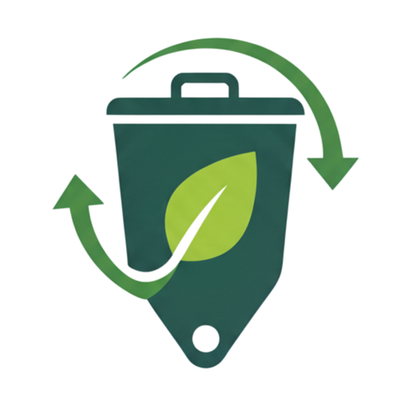

<a id="readme-top"></a>

<!-- PROJECT SHIELDS -->

[![Contributors][contributors-shield]][contributors-url]
[![Forks][forks-shield]][forks-url]
[![Stargazers][stars-shield]][stars-url]
[![Issues][issues-shield]][issues-url]

<!-- PROJECT LOGO -->
<br />
<div align="center">
  <a href="https://github.com/KvJellyBean/JakOlah">
    
  </a>

<h3 align="center">JakOlah</h3>

  <p align="center">
    Smart Waste Classification System for Jakarta Households
    <br />
    ML-powered waste sorting application to improve Jakarta's waste management using CNN+SVM
    <br />
    <br />
    <a href="https://jakolah.vercel.app">View Demo</a>
    ·
    <a href="https://github.com/KvJellyBean/JakOlah/issues">Report Bug</a>
    ·
    <a href="https://github.com/KvJellyBean/JakOlah/issues">Request Feature</a>
  </p>
</div>

<!-- TABLE OF CONTENTS -->
<details>
  <summary>Table of Contents</summary>
  <ol>
    <li>
      <a href="#about-the-project">About The Project</a>
      <ul>
        <li><a href="#built-with">Built With</a></li>
        <li><a href="#features">Features</a></li>
      </ul>
    </li>
    <li>
      <a href="#getting-started">Getting Started</a>
      <ul>
        <li><a href="#prerequisites">Prerequisites</a></li>
        <li><a href="#installation">Installation</a></li>
      </ul>
    </li>
    <li><a href="#usage">Usage</a></li>
    <li><a href="#api-documentation">API Documentation</a></li>
    <li><a href="#roadmap">Roadmap</a></li>
    <li><a href="#contributing">Contributing</a></li>
  </ol>
</details>

<!-- ABOUT THE PROJECT -->

## About The Project

[![JakOlah Screenshot][product-screenshot]](https://jakolah.vercel.app)

JakOlah is an intelligent waste classification system designed specifically for Jakarta households to improve waste management practices. Using advanced CNN+SVM machine learning models, the application can classify waste images into three categories: **Organik** (Organic), **Anorganik** (Inorganic), and **Lainnya** (Others).

**Why JakOlah?**

- Jakarta produces over 7,000 tons of waste daily, with poor sorting practices
- Real-time camera-based classification makes waste sorting faster and more accurate
- Interactive map helps citizens find nearest disposal facilities instantly

The system combines real-time object detection with machine learning classification to provide instant feedback through visual bounding boxes, making waste sorting accessible and educational for everyone.

<p align="right">(<a href="#readme-top">back to top</a>)</p>

### Built With

- [![Next][Next.js]][Next-url]
- [![React][React.js]][React-url]
- [![Tailwind][TailwindCSS.com]][Tailwind-url]
- [![Python][Python.org]][Python-url]
- [![FastAPI][FastAPI.com]][FastAPI-url]
- [![Supabase][Supabase.com]][Supabase-url]

<p align="right">(<a href="#readme-top">back to top</a>)</p>

### Features

- 🤖 **ML-Powered Classification**: CNN+SVM pipeline with >85% accuracy
- 📱 **Mobile-First Design**: Responsive web app optimized for mobile devices
- 🗺️ **Facility Mapping**: Interactive map showing nearest waste facilities
- 📚 **Educational Content**: Jakarta-specific disposal guidelines and tips
- 🔒 **Privacy-First**: Row-level security and complete data deletion rights
- 🇮🇩 **Indonesian Language**: Complete localization for Indonesian users
- 📦 **Real-time Detection**: Live camera feed with bounding box visualization

<p align="right">(<a href="#readme-top">back to top</a>)</p>

<!-- GETTING STARTED -->

## Getting Started

Follow these steps to set up JakOlah locally for development.

### Prerequisites

Ensure you have the following installed:

- **Node.js 18+**
  ```sh
  node --version
  ```
- **Python 3.11+**
  ```sh
  python --version
  ```
- **Git**
  ```sh
  git --version
  ```

### Installation

1. **Clone the repository**

   ```sh
   git clone https://github.com/KvJellyBean/JakOlah.git
   cd JakOlah
   ```

2. **Set up the frontend**

   ```sh
   cd frontend
   npm install
   cp .env.example .env.local
   ```

3. **Configure environment variables**

   Edit `frontend/.env.local`:

   ```env
   NEXT_PUBLIC_SUPABASE_URL=your_supabase_url
   NEXT_PUBLIC_SUPABASE_ANON_KEY=your_supabase_anon_key
   SUPABASE_SERVICE_ROLE_KEY=your_service_role_key
   NEXT_PUBLIC_ML_SERVICE_URL=http://localhost:8000
   ```

4. **Set up the ML service**

   ```sh
   cd ../ml-service
   python -m venv venv
   venv\Scripts\activate  # Windows
   # or
   source venv/bin/activate  # macOS/Linux
   pip install -r requirements.txt
   ```

5. **Download trained models**

   Place your trained models in `ml-service/models/`:

   - `MobileNetV3_poly_model.pkl` - SVM classifier
   - `mobilenet_scaler.pkl` - Feature scaler
   - `best.pt` - detection model

6. **Set up database**

   ```sh
   npm install -g supabase
   supabase login
   supabase link --project-ref your-project-ref
   supabase db push
   ```

7. **Start development servers**

   ```sh
   # Terminal 1 - Frontend
   cd frontend
   npm run dev

   # Terminal 2 - ML Service
   cd ml-service
   uvicorn app.main:app --reload --host 0.0.0.0 --port 8000
   ```

<p align="right">(<a href="#readme-top">back to top</a>)</p>

<!-- USAGE EXAMPLES -->

## Usage

### Basic Classification

1. Navigate to http://localhost:3000
2. Click **"Klasifikasi"**
3. Allow camera access
4. Point camera at waste item
5. Get instant classification with confidence scores and bounding box
6. View nearby facilities by allowing location access

### API Usage

```javascript
// Classify waste image
const response = await fetch("http://localhost:8000/api/classify-frame", {
  method: "POST",
  body: formData, // FormData with image file
});

const result = await response.json();
// Returns: { success, data: { detections, metadata } }
```

_For detailed API documentation, please refer to the [API Documentation](#api-documentation)_

<p align="right">(<a href="#readme-top">back to top</a>)</p>

<!-- API DOCUMENTATION -->

## API Documentation

### ML Service Endpoints

- `POST /api/classify-frame` - Classify waste image with object detection + CNN-SVM classification
- `GET /health` - Health check endpoint for monitoring service status

### Supabase RPC Functions

- `get_facilities_with_categories` - Get waste facilities with category filtering

<p align="right">(<a href="#readme-top">back to top</a>)</p>

<!-- ROADMAP -->

## Roadmap

- [x] **Phase 1**: Infrastructure setup
- [x] **Phase 2**: Database schema setup
- [x] **Phase 3**: ML inference service integration with trained models
- [x] **Phase 4**: Frontend UI components implementation
- [x] **Phase 5**: Real-time classification with bounding box detection
- [x] **Phase 6**: Interactive facility map with filtering

<p align="right">(<a href="#readme-top">back to top</a>)</p>

<!-- CONTRIBUTING -->

## Contributing

Contributions make the open source community amazing! Any contributions you make are **greatly appreciated**.

If you have suggestions for improvements:

1. Fork the Project
2. Create your Feature Branch (`git checkout -b feature/AmazingFeature`)
3. Commit your Changes (`git commit -m 'Add some AmazingFeature'`)
4. Push to the Branch (`git push origin feature/AmazingFeature`)
5. Open a Pull Request

### Development Guidelines

- Follow TypeScript strict mode
- Use Prettier for code formatting
- Write meaningful commit messages

<p align="right">(<a href="#readme-top">back to top</a>)</p>

<!-- MARKDOWN LINKS & IMAGES -->

[contributors-shield]: https://img.shields.io/github/contributors/KvJellyBean/JakOlah.svg?style=for-the-badge
[contributors-url]: https://github.com/KvJellyBean/JakOlah/graphs/contributors
[forks-shield]: https://img.shields.io/github/forks/KvJellyBean/JakOlah.svg?style=for-the-badge
[forks-url]: https://github.com/KvJellyBean/JakOlah/network/members
[stars-shield]: https://img.shields.io/github/stars/KvJellyBean/JakOlah.svg?style=for-the-badge
[stars-url]: https://github.com/KvJellyBean/JakOlah/stargazers
[issues-shield]: https://img.shields.io/github/issues/KvJellyBean/JakOlah.svg?style=for-the-badge
[issues-url]: https://github.com/KvJellyBean/JakOlah/issues

[product-screenshot]: UI/PC/Beranda PC.png

<!-- Technology Badges -->

[Next.js]: https://img.shields.io/badge/next.js-000000?style=for-the-badge&logo=nextdotjs&logoColor=white
[Next-url]: https://nextjs.org/
[React.js]: https://img.shields.io/badge/React-20232A?style=for-the-badge&logo=react&logoColor=61DAFB
[React-url]: https://reactjs.org/
[TailwindCSS.com]: https://img.shields.io/badge/Tailwind_CSS-38B2AC?style=for-the-badge&logo=tailwind-css&logoColor=white
[Tailwind-url]: https://tailwindcss.com/
[FastAPI.com]: https://img.shields.io/badge/FastAPI-005571?style=for-the-badge&logo=fastapi&logoColor=white
[FastAPI-url]: https://fastapi.tiangolo.com/
[Supabase.com]: https://img.shields.io/badge/Supabase-3ECF8E?style=for-the-badge&logo=supabase&logoColor=white
[Supabase-url]: https://supabase.com/
[Python.org]: https://img.shields.io/badge/Python-3776AB?style=for-the-badge&logo=python&logoColor=white
[Python-url]: https://www.python.org/
